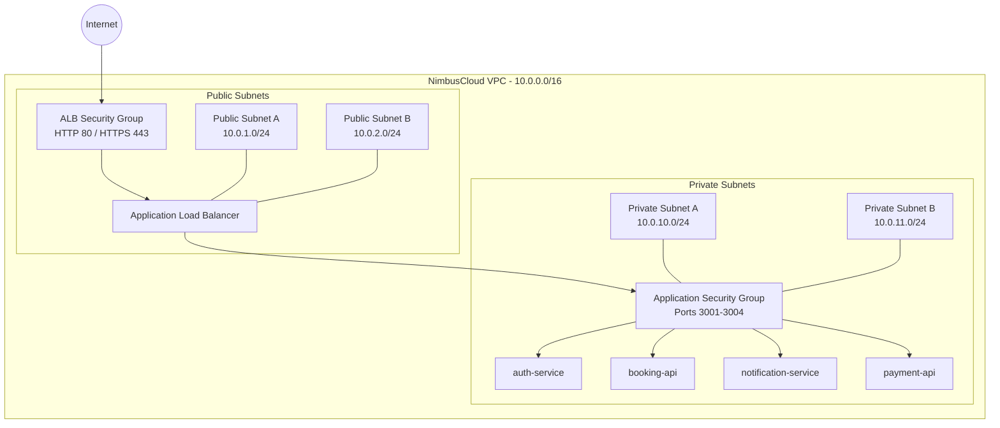

# NimbusCloud Network Topology

```mermaid
flowchart TB
    Internet((Internet))

    subgraph VPC["NimbusCloud VPC - 10.0.0.0/16"]

        subgraph PUBLIC["Public Subnets"]
            PUBA["Public Subnet A<br/>10.0.1.0/24"]
            PUBB["Public Subnet B<br/>10.0.2.0/24"]

            ALB["Application Load Balancer"]
            ALBSG["ALB Security Group<br/>HTTP 80 / HTTPS 443"]
        end

        subgraph PRIVATE["Private Subnets"]
            PRIVA["Private Subnet A<br/>10.0.10.0/24"]
            PRIVB["Private Subnet B<br/>10.0.11.0/24"]

            AUTH["auth-service"]
            BOOKING["booking-api"]
            NOTIFY["notification-service"]
            PAYMENT["payment-api"]

            APPSG["Application Security Group<br/>Ports 3001-3004"]
        end
    end

    Internet --> ALBSG
    ALBSG --> ALB

    PUBA --- ALB
    PUBB --- ALB

    ALB --> APPSG

    APPSG --> AUTH
    APPSG --> BOOKING
    APPSG --> NOTIFY
    APPSG --> PAYMENT

    PRIVA --- APPSG
    PRIVB --- APPSG
```
